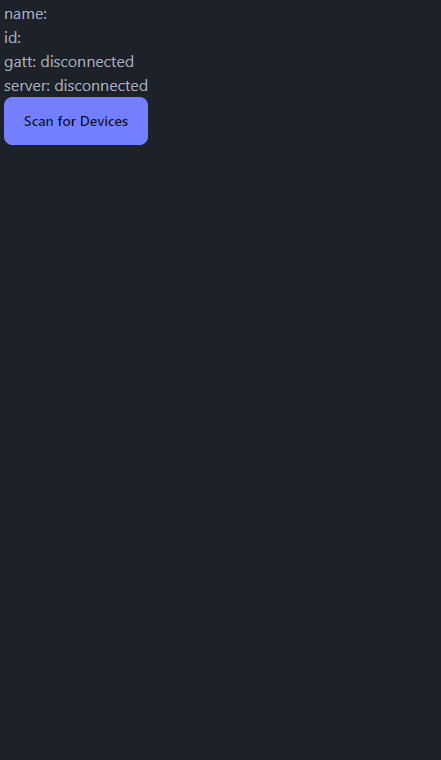

# BLE Gamepad partner App

## Overview

This is a sample application that demonstrates how to use the BLE Gamepad service. The application is designed to run on a mobile device and communicate with the BLE Gamepad [sample application](https://github.com/jamessizeland/Rust-BLE-embedded-gamepad) running on a development board. The application allows the user to control the development board using the mobile device or web browser.

[Demo Link](https://jamessizeland.github.io/web-ble-demo/)

